# Pembuatan Web Server dari Menu XAMPP

## Langkah Langkah Menggunakan XMPP Dengan Menggunakan Format Dokumen (.php)

### Menjalankan Web Server

Untuk menjalankan web server dari menu XAMPP Control

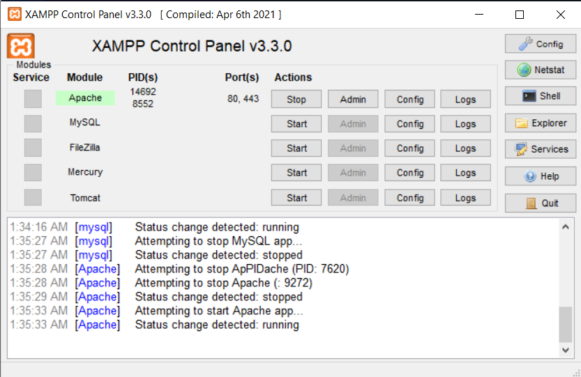

### Memulai PHP

Buat folder **lab7_php_dasar** pada root directory web server **(c:\xampp\htdocs)**.

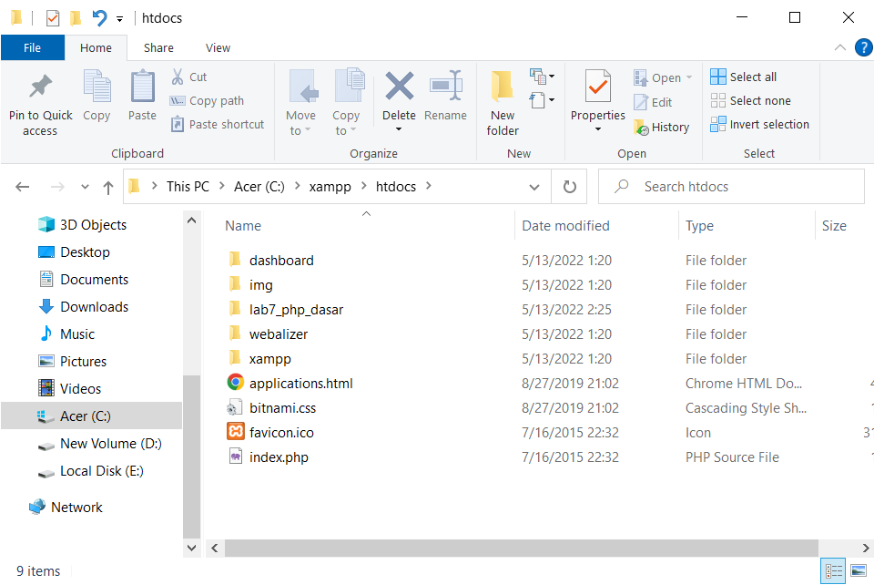
Kemudian untuk mengakses directory tersebut pada web server dengan mengakses URL: http://localhost/lab7_php_dasar/

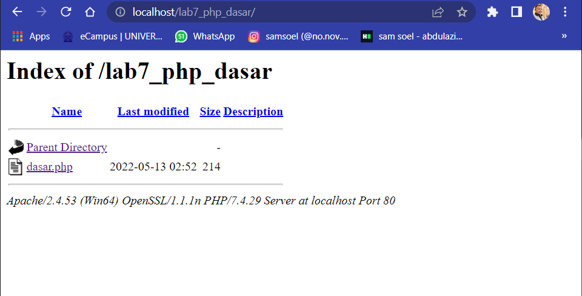

### PHP Dasar

Buat file baru dengan nama _dasar.php_ pada directory tersebut. Kemudian buat kode seperti berikut.

```php
<!DOCTYPE html>
<html lang="en">
<head>
    <meta charset="UTF-8">
    <title>PHP Dasar</title>
</head>
<body>
    <h1>Belajar PHP Dasar</h1>
    <?php
        echo "Hello world";
    ?>
</body>
</html>
```

Kemudian untuk mengakses hasilnya melali URL: http://localhost/lab7_php_dasar/dasar.php

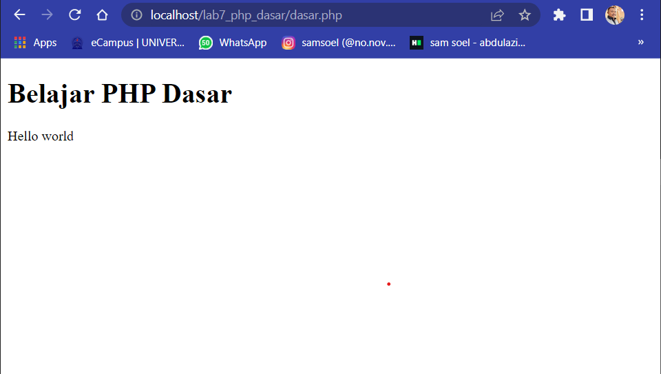

### Variable PHP

Menambahkan variable pada program.

```php
<?php
       $nim = "312010049";
       $nama = 'Abdul Aziz Anaoval';
       echo "NIM : " . $nim . "<br>";
       echo "Nama : $nama";
   ?>
```

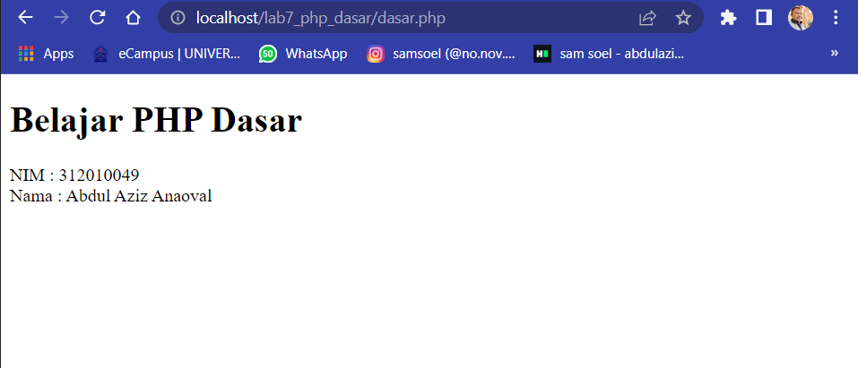

### predifine Variable $\_GET

```php
<?php
echo 'Selamat Datang ' . $_GET['nama'];
?>
```

Untuk mengaksesnya gunakan URL:
http://localhost/lab7_php_dasar/latihan2.php?nama=Noval

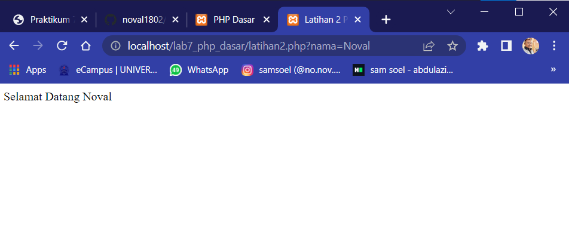

### Membuat Form Input

```php
<!DOCTYPE html>
<html lang="en">

<head>
    <meta charset="UTF-8">
    <title>Latihan 2 PHP</title>
</head>

<body>
    <h2>Form Input</h2>

    <form method="post">
        <label>Nama: </label>
        <input type="text" name="nama">
        <input type="submit" value="kirim">
    </form>
    <?php
    echo 'Selamat Datang ' . $_GET['nama'];
    ?>
</body>

</html>
```

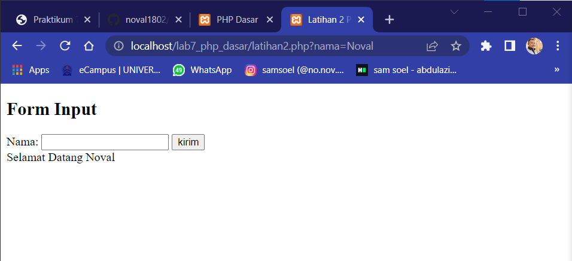

### Oprator

```php
<!DOCTYPE html>
<html lang="en">

<head>
    <meta charset="UTF-8">
    <title>Document</title>
</head>

<body>
    <?php
    $gaji = 1000000;
    $pajak = 0.1;
    $thp = $gaji - ($gaji * $pajak);
    echo "Gaji sebelum pajak = Rp. $gaji <br>";
    echo "Gaji yang dibawa pulang = Rp. $thp";
    ?>

</body>

</html>
```
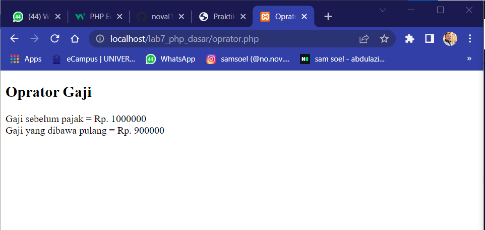

### Kondisi IF

```php
  <h2>Kondisi IF</h2>
    <?php
    $nama_hari = date("l");
    if ($nama_hari == "Sunday") {
        echo "Minggu";
    } elseif ($nama_hari == "Monday") {
        echo "Senin";
    } else {
        echo "Selasa";
    }
    ?>
```


### Kondisi Switch

```php
<?php
    $nama_hari = date("1");
    switch ($nama_hari) {
        case "Sunday":
            break;
            echo "minggu";
            break;
        case "Monday":
            echo "Senin";
            break;
        case "Tuesday":
            echo "Selasa";
            break;
        default:
            echo "Sabtu";
    }
    echo"/$nama_hari";
    ?>
```
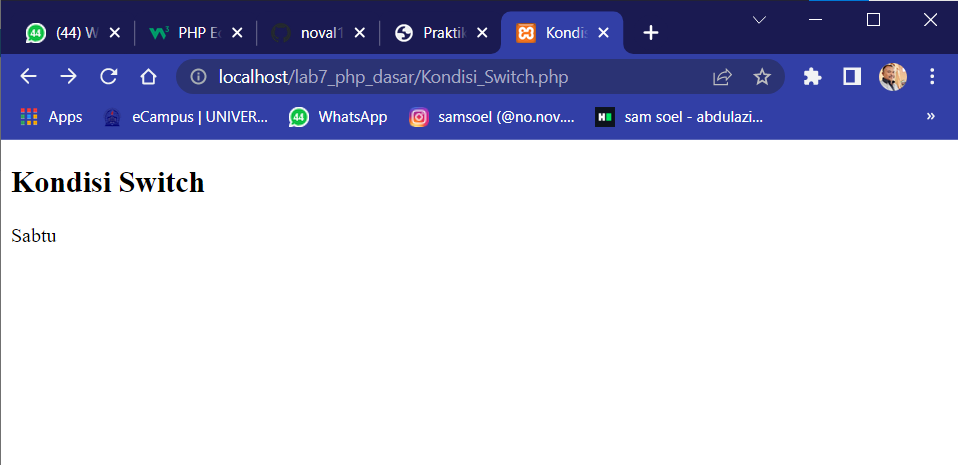

### Pengulangan For

```php
<?php
    echo "Perulangan 1 sampai 10 <br />";
    for ($i = 1; $i <= 10; $i++) {
        echo "Perulangan ke: " . $i . '<br />';
    }
    echo "Perulangan Menurun dari 10 ke 1 <br />";
    for ($i = 10; $i >= 1; $i--) {
        echo "Perulangan ke: " . $i . '<br />';
    }
    ?>
```
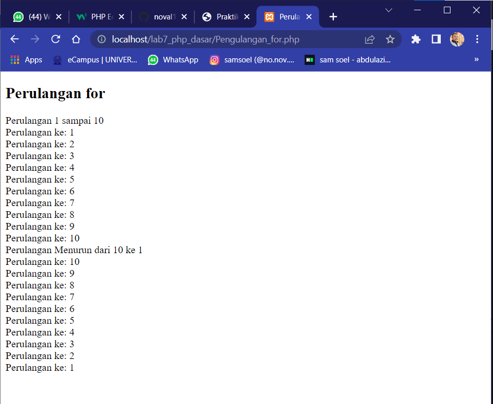

### Pengulangan While 

```php
<?php
    echo "Perulangan 1 sampai 10 <br />";
    $i = 1;
    while ($i <= 10) {
        echo "Perulangan ke: " . $i . '<br />';
        $i++;
    }
    ?>
```
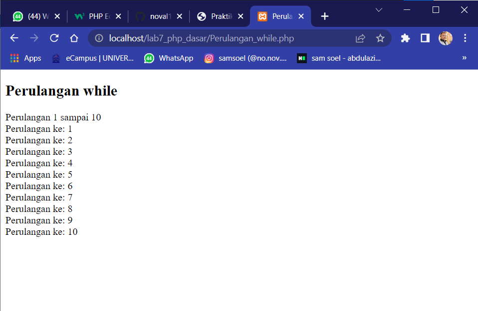

### Pengulangan Dowhile

```php
 </h2>
    <?php
    echo "Perulangan 1 sampai 10 <br />";
    $i = 1;
    do {
        echo "Perulangan ke: " . $i . '<br />';
        $i++;
    } while ($i <= 10);
    ?>
```

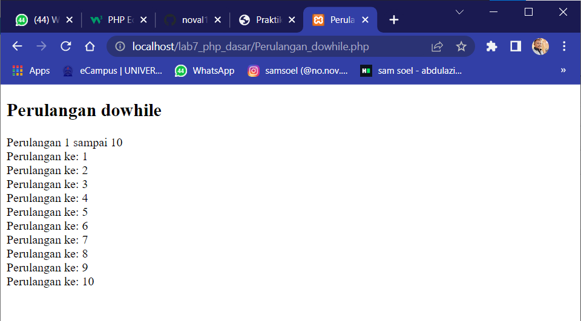


# Pertanyaan dan Tugas

Buatlah program PHP sederhana dengan menggunakan form input yang menampilkan nama, tanggal lahir dan pekerjaan. Kemudian tampilkan outputnya dengan menghitung umur berdasarkan inputan tanggal lahir. Dan pilihan pekerjaan dengan gaji yang berbeda-beda sesuai pilihan pekerjaan.

```php

<!DOCTYPE html>
<html lang="en">

<head>
    <meta charset="UTF-8">
    <title>Form Input</title>
</head>

<body>
    <!--Table Form-->
    <form class="form" method="post">
        <table align="center">
            <td>
                <h2> <b>Form Biodata</h2>
            </td>
            <tr></tr>
            <table width="450" border="0" cellpadding="0" cellspacing="10" align="center">
                <!--Table Nama-->
                <tr>
                    <td>Nama</td>
                    <td> : </td>
                    <td><input name="nama" type="text" size="40" /></td>
                </tr>
                <!--End Table Nama-->

                <!--Table Tanggal Lahir-->
                <tr>
                    <td>Tanggal Lahir</td>
                    <td> : </td>
                    <td><input name="tgl_lahir" type="text" size="40"/></td>
                </tr>
                <!--End Table Tanggal lahir-->

                <!--Table Pekerjaan-->
                <tr>
                    <td>Pekerjaan</td>
                    <td> : </td>
                    <td>
                        <select name="pekerjaan">
                            <option value="-">>---Pilih Pekerjaan---<</option>
                            <option value='Graphic Designer'>Graphic Designer</option>
                            <option value='Staff Admin'>Staff Admin</option>
                            <option value='HRD'>HRD</option>
                            <option value='Maintenance'>Maintenance</option>
                            <option value="QC">QC</option>
                        </select>
                    </td>
                </tr>
                <!--End Table Pekerjaan-->

                <!--BTN Submit-->
                <tr>
                    <td colspan="4" align="center"> <input type="submit" value="Simpan"></td>
                </tr>
                <!--END BTN Submit-->
            </table>
        </table>
    </form>
    <!--END Table Form-->
</body>

</html>
<tr>
    <td align="center" colspan="2"></td>
<?php
echo "<b>Hasil Biodata yang di Inputkan</b>"
?>
</tr>
<?php
echo "Nama: " . $_POST["nama"];

$tgl_lahir = @$_POST["tgl_lahir"];

$lahir = new DateTime($tgl_lahir);
$hari_ini = new DateTime();

$diff = $hari_ini->diff($lahir);
echo "Umur: " . $diff->y . "Tahun";

echo "pekerjaan: " . $_POST["pekerjaan"];
$pekerjaan = @$_POST["pekerjaan"];

if ($pekerjaan == "Graphic Designer") {
    echo '<br> Gaji: Rp. 15.000.000,-';
} elseif ($pekerjaan == "Staff Admin") {
    echo '<br> Gaji: Rp. 7.500.000,-';
} elseif ($pekerjaan == "HRD") {
    echo '<br> Gaji: Rp. 10.000.000,-';
} elseif ($pekerjaan == "Maintenance") {
    echo '<br> Gaji: Rp. 9.000.000,-';
} elseif ($pekerjaan == "QC") {
    echo '<br> Gaji: Rp. 7.000.000,-';
}
?>
```