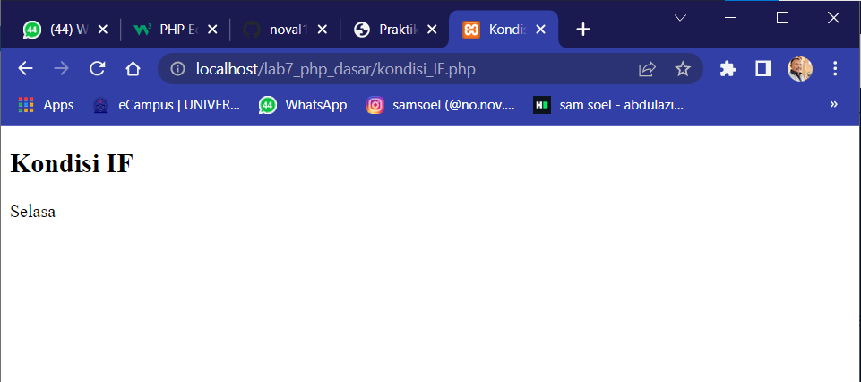

# Pembuatan Web Server dari Menu XAMPP

## Langkah Langkah Menggunakan XMPP Dengan Menggunakan Format Dokumen (.php)

### 1. Menjalankan Web Server

Untuk menjalankan web server dari menu XAMPP Control


### 2. Memulai PHP

Buat folder **lab7_php_dasar** pada root directory web server **(c:\xampp\htdocs)**.


Kemudian untuk mengakses directory tersebut pada web server dengan mengakses URL: http://localhost/lab7_php_dasar/


### 3. PHP Dasar

Buat file baru dengan nama _dasar.php_ pada directory tersebut. Kemudian buat kode seperti berikut.

```php
<!DOCTYPE html>
<html lang="en">
<head>
    <meta charset="UTF-8">
    <title>PHP Dasar</title>
</head>
<body>
    <h1>Belajar PHP Dasar</h1>
    <?php
        echo "Hello world";
    ?>
</body>
</html>
```

Kemudian untuk mengakses hasilnya melali URL: http://localhost/lab7_php_dasar/dasar.php


### 4. Variable PHP

Menambahkan variable pada program.

```php
<?php
       $nim = "312010049";
       $nama = 'Abdul Aziz Anaoval';
       echo "NIM : " . $nim . "<br>";
       echo "Nama : $nama";
   ?>
```


### 5. predifine Variable $\_GET

```php
<?php
echo 'Selamat Datang ' . $_GET['nama'];
?>
```

Untuk mengaksesnya gunakan URL:
http://localhost/lab7_php_dasar/latihan2.php?nama=Noval


### 6. Membuat Form Input

```php
<!DOCTYPE html>
<html lang="en">

<head>
    <meta charset="UTF-8">
    <title>Latihan 2 PHP</title>
</head>

<body>
    <h2>Form Input</h2>

    <form method="post">
        <label>Nama: </label>
        <input type="text" name="nama">
        <input type="submit" value="kirim">
    </form>
    <?php
    echo 'Selamat Datang ' . $_GET['nama'];
    ?>
</body>

</html>
```


### 7. Oprator

```php
<!DOCTYPE html>
<html lang="en">

<head>
    <meta charset="UTF-8">
    <title>Document</title>
</head>

<body>
    <?php
    $gaji = 1000000;
    $pajak = 0.1;
    $thp = $gaji - ($gaji * $pajak);
    echo "Gaji sebelum pajak = Rp. $gaji <br>";
    echo "Gaji yang dibawa pulang = Rp. $thp";
    ?>

</body>

</html>
```


### 8. Kondisi IF

```php
  <h2>Kondisi IF</h2>
    <?php
    $nama_hari = date("l");
    if ($nama_hari == "Sunday") {
        echo "Minggu";
    } elseif ($nama_hari == "Monday") {
        echo "Senin";
    } else {
        echo "Selasa";
    }
    ?>
```


# Pertanyaan dan Tugas

Buatlah program PHP sederhana dengan menggunakan form input yang menampilkan nama, tanggal lahir dan pekerjaan. Kemudian tampilkan outputnya dengan menghitung umur berdasarkan inputan tanggal lahir. Dan pilihan pekerjaan dengan gaji yang berbeda-beda sesuai pilihan pekerjaan.
